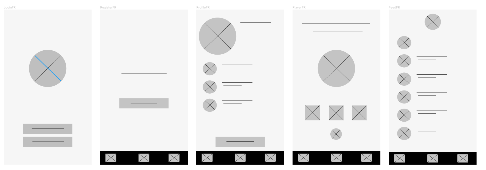

# Spotigram

## Table of Contents
1. [Overview](#Overview)
1. [Product Spec](#Product-Spec)
1. [Wireframes](#Wireframes)
2. [Schema](#Schema)

## Overview
### Description
This is an Android based application which uses Spotify's API to call songs and lyrics.

### App Evaluation
[Evaluation of your app across the following attributes]
- **Category:** Social Network / Music
- **Mobile:** The app is primarily developed for mobile use. It can be also developed to be a web application in the future
- **Story:** People are being connected based on what kind of music they like. User's can like and share music which is being reflected in their own profile.
- **Market:** Any individual who loves sharing and listening to music and also open to seeing what other people are listening to.
- **Habit:** This app can be used depending on how often a user listen to music or share them.
- **Scope:** This is a music sharing app where people are able to listen and share their favorite music and artists.

## Product Spec

### 1. User Stories (Required and Optional)

**Required Must-have Stories**

* Users are able to register in the app
* Users are able to login and stay logged in after closing the app
* Users are able to log out of the app
* Users are able to naviagate using the bottom naviagation bar between the following (Feed, Songs, Profile)
* Users are able to generate and view random songs using Spotify's API
* Users are able to click on their profile see their own name, profile picture and liked post
* Users are able to put a song of their liking on their own feed

**Optional Nice-to-have Stories**

* Users are able to share a song with others using a share button
* Users are able to like , dislike a post feed
* Users are able to comment on a post feed
* Users are able to generate based on genre 
* Users are able to generate based on Artist
* Users are able to generate based on a top list (50)
* Users are able to view lyrics of the songs 

### 2. Screen Archetypes

* Login  
* Register  
   * Users can register their own account  
* Profile Screen  
   * Upon logging in and registering, the first page the user will see is their profile page where it lists their favorite music  
* Player Screen  
   * Users can play their selected song or random music depending on artist and genre
* Feed Screen
   * Users can see which songs other users liked

### 3. Navigation

**Tab Navigation** (Tab to Screen)

* Profile
* Feed
* Player

**Flow Navigation** (Screen to Screen)

* Login -> Profile
   * Register -> Profile if no login information available yet
* Profile / Feed -> Player [Selected Songs]

## Wireframes

### [BONUS] Digital Wireframes & Mockups

### [BONUS] Interactive Prototype

## Schema 
[This section will be completed in Unit 9]
### Models
[Add table of models]
### Networking
- [Add list of network requests by screen ]
- [Create basic snippets for each Parse network request]
- [OPTIONAL: List endpoints if using existing API such as Yelp]
